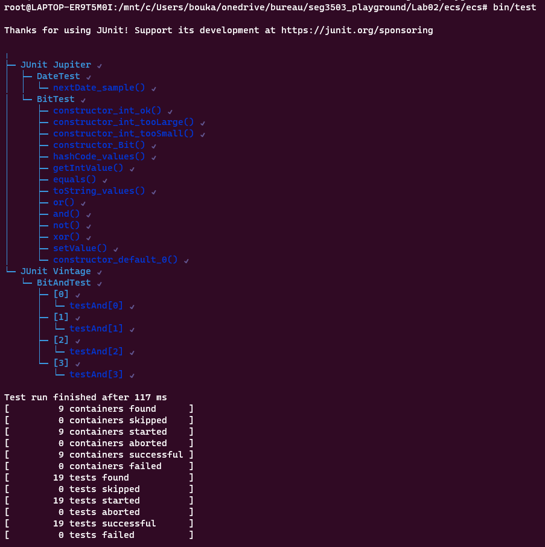

## Exercice 1 

Je run cette commande **bin/run** et puis je visite **http://localhost:8080**

  
| Cas de Test | Résultats Escomptés | Résultats Actuels | Verdict (Succès, Échec, Non-concluant) |
|:----------:|:-------------:|:------:|:------:| 
1| Accepté | Accepté        |Succès |
2| Accepté | Accepté        |Succès |
3| Accepté | Accepté        |Succès |
4| Accepté | Accepté        |Succès |
5| Err1 | Err1    |Succès |
6| Err2 | Err2    |Succès |
7| Err3 | Err3   |Succès |
8| Err4 et Err3 | Err4 et Err3   |Succès |  
9| Err5 | Err5   |Succès |   
  

## JUnit Parameterized Test
Resultat après execution du test avec la commande **bin/test** :

## Exercice 2
Resultat après execution du test avec la commande **bin/test** :

**Capture de parameterized test pour des cas OK et qui retournent une date :**

**Capture de parameterized test pour des cas d'exception et qui retournent une erreur :**

**Capture d'un code de test sans exception :**

**Capture d'un code de test avec exception :**

